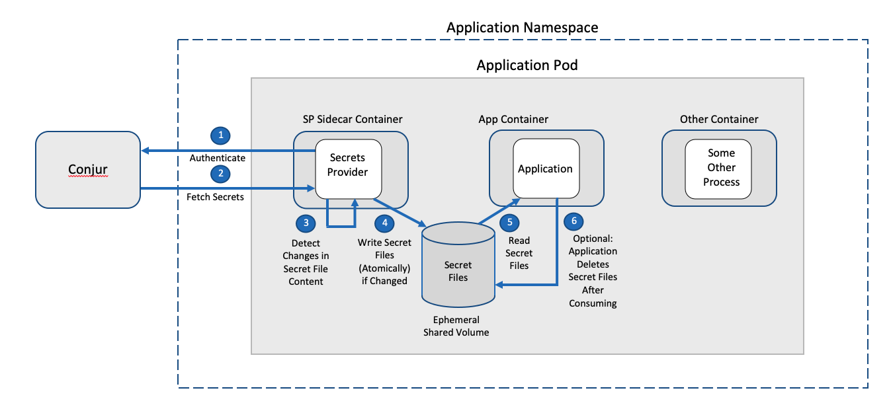

# Secrets Provider - Secrets Rotation

## Table of Contents

- [Table of Contents](#table-of-contents)
- [Overview](#overview)
- [How Secrets Rotation Works](#how-secrets-rotation-works)
- [Set up Secrets Provider for secrets rotation](#set-up-secrets-provider-for-secrets-rotation)
- [Additional Configuration Annotations](#reference-table-of-configuration-annotations)
- [Using Sentinel files](#using-sentinel-files-for-checking-provider-status)
- [Troubleshooting](#troubleshooting)

## Overview

The secrets rotation feature detailed below allows Kubernetes applications to
refresh Secrets Manager secrets if there are any changes to the secrets.

## How Secrets Rotation Works



Note: see [how-push-to-file-works](PUSH_TO_FILE.md#how-push-to-file-works) for more detail on
how Push to File works.

1. The Secrets Provider authenticates to the Secrets Manager server using the
   Kubernetes Authenticator (`conjur-authn-k8s-client`).

2. The Secrets Provider reads all Secrets Manager secrets required across all
   [secret groups](PUSH_TO_FILE.md#reference-table-of-configuration-annotations).

3. The Secrets Provider sidecar container starts up and retrieves the initial secrets.
   If secrets rotation is enabled, after the duration specified by `conjur.org/secrets-refresh-interval` or the default interval
   the Secrets Provider will check if the secrets have changed by comparing the SHA-256 checksums
   of the secrets with the previous checksums. The Secrets Provider does not save any of the unencrypted secrets.
  If the time needed to fetch the secrets is longer than is specified
   for the duration, then the duration will be the actual time to retrieve the secrets.

   For example:
   If the duration is set to two seconds, but retrieving the secrets takes three second then the
   secrets will be updated every three seconds.

   Note:
   If one or more of the secrets have been removed from Secrets Manager or have had access revoked, the Secrets Provider
   will remove the secrets files from the shared volume. To disable this feature, set the
   `conjur.org/remove-deleted-secrets-enabled` annotation to `false`.
4. The Secrets Provider renders secret files for each secret group, and
   writes the resulting files to a volume that is shared with your application
   container. The Secrets Provider will rewrite the secret files if there are any changes.
5. The application reads the secrets.
6. The application can optionally delete the secret files after consuming.
   If the secret files are deleted, they will only be recreated when the secret values have changed.

## Set up Secrets Provider for secrets rotation

There are two new annotations introduced and one annotation is updated.

Prerequisites:

Requires secrets-provider-for-k8s v1.4.0 or later.

<details><summary>For Push to File mode</summary>

Follow the procedure to set up Secrets Provider for [Push to File](PUSH_TO_FILE.md#set-up-secrets-provider-for-push-to-file)
</details>
<details><summary>For Kubernetes Secrets mode</summary>

Follow the procedure to set up [Kubernetes Secrets](https://docs.cyberark.com/Product-Doc/OnlineHelp/AAM-DAP/Latest/en/Content/Integrations/k8s-ocp/cjr-k8s-secrets-provider-ic.htm?tocpath=Integrations%7COpenShift%252FKubernetes%7CSet%20up%20applications%7CSecrets%20Provider%20for%20Kubernetes%7CInit%20container%7C_____1#SetupSecretsProviderasaninitcontainer)
</details>

Modify the Kubernetes manifest
1. Change the Secrets provider container to be a sidecar. If it was configured
   as an init container remove the `initContainers` so the image is in the containers section as below:
   ```yaml
    spec:
      containers:
      - image: secrets-provider-for-k8s:latest
    ```
   
2. Update the `conjur.org/container-mode` annotation:
   ```yaml
   conjur.org/container-mode: sidecar
   ```

3. Add the new Secrets Rotation annotations.
   There are two new annotations added, only one of the annotations is
   required to be set to enable secrets rotation.

   `conjur.org/secrets-refresh-enabled` enables the
   feature if the container mode is `sidecar`. The default duration is 5 minutes if the
   duration is not specified with the `conjur.org/secrets-refresh-interval`.


   `conjur.org/secrets-refresh-interval` Sets the duration and is a string as defined [here](https://pkg.go.dev/time#ParseDuration).
   Setting a time implicitly enables refresh. Valid time units are `s`, `m`, and `h` 
   (for seconds, minutes, and hours, respectively). Some examples of valid duration 
   strings:<ul><li>`5m`</li><li>`2h30m`</li><li>`48h`</li></ul>The minimum refresh interval is 1 second.
   A refresh interval of 0 seconds is treated as a fatal configuration error.
   ```yaml
   conjur.org/secrets-refresh-enabled: "true"
   conjur.org/secrets-refresh-interval: 10m
   ```
   [Here is the example push file manifest modified for rotation.](assets/p2f-rotation.yaml)

   [For comparison, a push to file manifest as an init container.](assets/push-to-file.yaml)

   Secrets Rotation can also be used with Kubernetes secrets.

   [Here is an example Kubernetes Secrets manifest modified for rotation.](assets/k8s-rotation.yaml)

   [For comparison, a Kubernetes Secrets manifest as an init container.](assets/k8s-secrets.yaml)

   Secrets Rotation can also be used with JWT authentication.
   [Here is an example JWT based push to file manifest modified for rotation.](assets/jwt-ptf-rotation.yaml)

   [Here is an example JWT based Kubernetes secrets manifest modified for rotation.](assets/jwt-k8s-rotation.yaml)

## Using sentinel files for checking provider status

Prerequisites for using sentinel files:

Requires secrets-provider-for-k8s v1.4.1 or later.<br>
Requires a shared volume that both the application and Secrets Provider can read and write to.

Secrets Provider allows for its status to be monitored through the creation of a couple of empty sentinel files:
`CONJUR_SECRETS_PROVIDED` and `CONJUR_SECRETS_UPDATED`. The first file is created when the SP has completed its first
round of providing secrets via secret files / Kubernetes Secrets. It creates/recreates the second file whenever it
has updated secret files / Kubernetes Secrets. If desirable, application containers can mount these files via a
shared volume.

The Pod would need a Volume defined:

```yaml
    volumes:
    - name: conjur-status
      emptyDir:
        medium: Memory
```

The application container and SP container would need to include volumeMounts similar to this:

```yaml
    volumeMounts:
    - mountPath: /conjur/status
      name: conjur-status
```

These sentinel files can be used to delay the start of the application until after the 
Secrets provider has started up and written the secrets. Kubelet will start the pod containers
in the order they are listed in the manifest. A `postStart` lifecycle hook
can be added to the Secrets Provider manifest which will delay the start of the app container
until the `postStart` lifecycle hook is complete.
See [conjur-secrets-provided](https://github.com/cyberark/secrets-provider-for-k8s/blob/main/bin/run-time-scripts/conjur-secrets-provided.sh)
for an example of the Secrets Provider script.

```yaml
        lifecycle:
          postStart:
            exec:
              command:
              - /usr/local/bin/conjur-secrets-provided.sh

```

A `livenessProbe` for an application container that would serve as a "file watcher" can potentially look 
something like this (assuming the livenessProbe is not already being used by the container as a health probe).
This will cause the application to be restarted after there secrets have been updated.

```yaml
 livenessProbe:
          exec:
            command:
            - /mounted/status/conjur-secrets-unchanged.sh
          failureThreshold: 1
          initialDelaySeconds: 5
          periodSeconds: 5
          successThreshold: 1
          timeoutSeconds: 1
```

By default, the Secrets Provider container runs using a default username `secrets-provider`,
user ID `777`, and group ID `777`. For the application to delete the sentinel files the app and
the Secrets provider should run as the same UID. For example the below securityContext 
can be added to both the Secrets Provider and the Application, replacing 9999 with your desired value.

```yaml
        securityContext:
          runAsUser: 9999
```

## Reference Table of Configuration Annotations

In addition to the [basic Secrets Provider configuration](https://github.com/cyberark/secrets-provider-for-k8s/blob/main/PUSH_TO_FILE.md#reference-table-of-configuration-annotations),
below is a list of annotations that are needed for secrets rotation.

| K8s Annotation  | Description |
|-----------------------------------------|----------------------------------|
| `conjur.org/container-mode`         | Configurable values: <ul><li>`init`</li><li>`application`</li><li>`sidecar`</li></ul>Defaults to `init`.<br>Must be set to `sidecar`for secrets rotation.|
| `conjur.org/secrets-refresh-enabled`  | Set to `true` to enable Secrets Rotation. Defaults to `false` unless `conjur.org/secrets-refresh-interval` is explicitly set. Secrets Provider will exit with error if this is set to `false` and `conjur.org/secrets-refresh-interval` is set. |
| `conjur.org/secrets-refresh-interval` | Set to a valid duration string as defined [here](https://pkg.go.dev/time#ParseDuration). Setting a time implicitly enables refresh. Valid time units are `s`, `m`, and `h` (for seconds, minutes, and hours, respectively). Some examples of valid duration strings:<ul><li>`5m`</li><li>`2h30m`</li><li>`48h`</li></ul>The minimum refresh interval is 1 second. A refresh interval of 0 seconds is treated as a fatal configuration error. The default refresh interval is 5 minutes. The maximum refresh interval is approximately 290 years. |
| `conjur.org/remove-deleted-secrets-enabled` | Set to `false` to disable deletion of secrets files from the shared volume when a secret is removed or access is revoked in Secrets Manager. Defaults to `true`. |

## Troubleshooting

This section describes how to troubleshoot common Secrets Provider for Kubernetes issues.

To enable the debug logs, See [enable-logs](PUSH_TO_FILE.md#enable-logs)

|  Issue      |       Error code   | Resolution  |
| ----------- | ------------------ | ------ |
| No change in secret files, no secret files written |CSPFK018I| This is an info message and not an error. It indicates that the Secrets Provider did not detect a change in secrets for a secrets group. The secret file for this group will not be written. Note: there may be changes in other secret groups and those files will be written. |
| Invalid secrets refresh interval annotation |CSPFK050E| There is an error with the interval annotation, check the log message for the exact failure reason. See the [annotation reference](#reference-table-of-configuration-annotations) for more information on setting the annotations.|
| Invalid secrets refresh configuration |CSPFK051E| Secrets refresh is enabled either by setting `conjur.org/secrets-refresh-enabled` to true or setting a duration for `conjur.org/secrets-refresh-interval` and the mode is not `sidecar`. The mode must be `sidecar`. |
