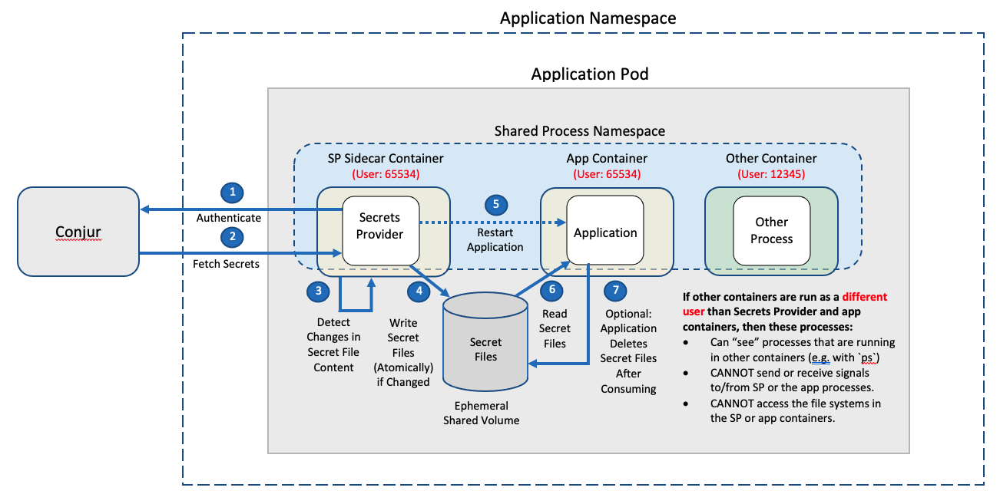
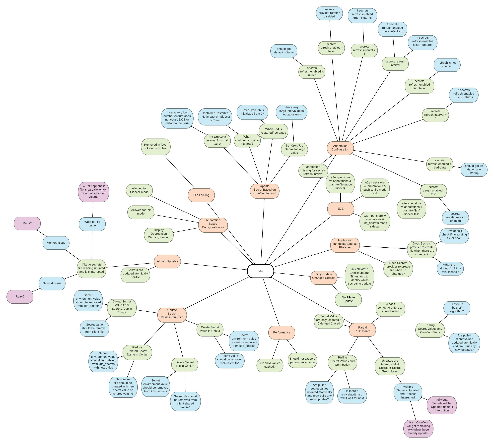
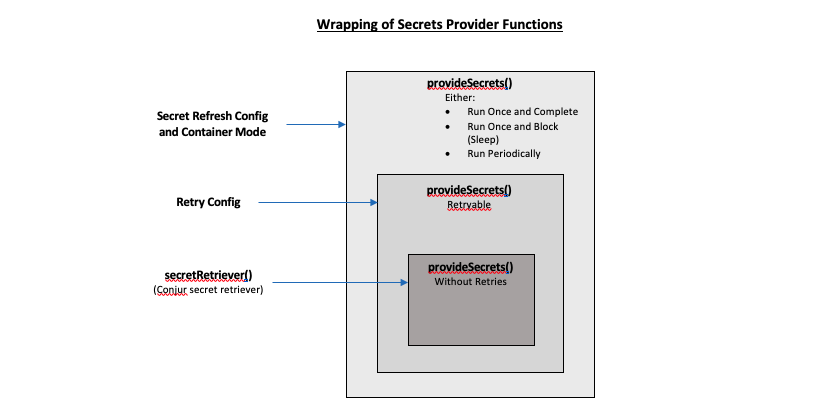

# Solution Design - Secrets Provider Secret Rotation

## Table of Contents

- [Useful Links](#useful-links)
- [Overview](#overview)
- [Solution](#solution)
- [Design](#design)
- [Performance](#performance)
- [Backwards Compatibility](#backwards-compatibility)
- [Affected Components](#affected-components)
- [Test Plan](#test-plan)
- [Logs](#logs)
- [Documentation](#documentation)
- [Version update](#version-update)
- [Security](#security)
- [Audit](#audit)
- [Development Tasks](#development-tasks)
- [Solution Review](#solution-review)

## Useful Links

| Link | Private |
|------|:-------:|
| PRD: Conjur Developer Experience for K8s (Sharepoint) | Yes |
| Feature Document: Secrets Provider Secret Rotation (Sharepoint) | Yes |
| [Kubernetes Documentation: Shared Process Namespace](https://kubernetes.io/docs/tasks/configure-pod-container/share-process-namespace/) | No |
| [Kubernetes Documentation: Annotations](https://kubernetes.io/docs/concepts/overview/working-with-objects/annotations/) | No |
| [Secrets Provider Documentation](https://docs.cyberark.com/Product-Doc/OnlineHelp/AAM-DAP/11.2/en/Content/Integrations/Kubernetes_deployApplicationsConjur-k8s-Secrets.htm?tocpath=Integrations%7COpenShift%252C%20Kubernetes%252C%20and%20GKE%7CDeploy%20Applications%7C_____3) | No |
| [Secrets Provider application-mode Helm chart manifest](https://github.com/cyberark/secrets-provider-for-k8s/blob/master/helm/secrets-provider/templates/secrets-provider.yaml) | No |

## Overview

The purpose of the Secrets Provider (SP) Secret Rotation Support feature is to
provide a mechanism for the Secrets Provider to periodically monitor for
changes in Conjur secret values, and when changes are detected, deliver
the new secret values to applications via updated Kubernetes Secrets
or Push-to-File secret files.

Secret rotation is supported for both Kubernetes Secrets destination mode
and Push-to-File mode.

#### How Secret Rotation Works

The diagram below shows the workflow followed for each iteration of the
Secrets Provider's periodic secret rotation cycle:


#### New Sidecar Container Mode

The periodic refresh of Conjur secrets requires deploying the Secrets
Provider as a Kubernetes sidecar container, which is a new operating mode
for the Secrets Provider that is being introduced with this design.

Allowing the Secrets Provider as a sidecar container provides an added benefit
that an application can recover from an application crash, even if the secret
files had been deleted by the application immediately after the files were
consumed (for improved security).

#### Conjur API Enhancements

##### Setting Multiple Secret Values Atomically

Secret rotation support involves having the Secrets Provider periodically
retrieve multiple secret values (in one bulk operation) from Conjur. It is
entirely possible that a Conjur administrator is still in the process of
updating these secrets at the moment the Secret Provider retrieves the
secrets from Conjur.

In order to guarantee that the Secrets Provider is retrieving a consistent
set of secrets (as opposed to retrieving some old secrets mixed with some new
secrets), Conjur API support is introduced that allows multiple secret
values to get set in one atomic operation.

This atomic operation must be able to perform roll back; that is, it must
be able to undo any database operations that have been completed as part of
the atomic transaction) when errors are encountered.

##### Reporting Multiple Variables in Error for Bulk Secrets Retrieval

When the Secrets Provider periodically retrieves Conjur secrets as part of
secret rotation support, it needs to know any and all secrets that:

- have had their values deleted from Conjur
- have had access revoked in Conjur

so that:

- Secrets Provider can delete these values from any Kubernetes Secrets to
  which they have been written (for `k8s-secret` destination mode)
- Secrets Provider can delete any secret files which contain these values
  (for `file` destination mode)

This requires an enhancement in Conjur bulk secrets retrieval such that
Conjur reports ALL secrets that are in error (i.e. have been deleted or
have had acces revoked) in response to a bulk retrieval operation.

#### Deprecation of Environment-Variable-Based Configuration

For either `init` or `sidecar` container modes combined with `k8s-secret`
destination mode, the configuration of the Secrets Provider using pure
environment variables is deprecated with this design. Users are encouraged
to use Pod-Annotation-based configurations for these scenerios.

This deprecation is expected to be almost entirely a testing and documentation
effort, since the Secrets Provider is designed to already support
Annotation-based configuration independent of operating modes.

## Solution

### User Experience

#### Feature Details

- **New Sidecar Container Mode:**

  Secrets Provider is able to run as a sidecar container (in addition to the
  init container and standalone Pod modes that are currently supported).

  When configured to run as a sidecar container, it is possible to configure
  the application Pod such that the application containers are not started
  until after the Secrets Provider has completed its initial round of
  providing secrets via secret files or Kubernetes Secrets. (See the
  [How to Configure Synchronized Container Startup](#how-to-configure-synchronized-container-startup)
  section below for details.)

  When running as a sidecar container, Kubernetes Secrets (in
  `k8s_secrets` mode) and secret files (in `file` mode) will be repopulated
  when Pod containers are restarted e.g. after an application crash. This
  means that applications can optionally delete secret files (or volume-mounted
  Kubernetes Secrets files) immediately after consuming the files, and the
  Pod will still be able to recover from container restarts.

  **User Stories:** US-01, US-03

- **Periodic Secret Rotation Support:**

  - **Periodic Secret Retrieval**

    Secrets Provider can be configured to periodically retrieve (with
    a customizable refresh interval) secret values from Conjur, and write/update
    Kubernetes Secrets (in `k8s_secrets` mode) or application secret files
    (in `file` mode) when secret values have changed.

    The periodic secret refresh interval is configurable. The default refresh
    interval is 5 minutes.

    Note that for `k8s_secrets` mode, updates to Kubernetes Secrets will
    only have an immediate effect if the application is consuming Kubernetes
    Secrets values via volume mounts (as opposed to consuming Kubernetes
    Secrets via environment variables).

    **User Stories:** US-03, US-04

  - **No Updates if Content Remains Unchanged**

    Kubernetes Secrets (in `k8s_secrets` mode) and secret files (in `file`
    mode) are NOT updated if their content remains unchanged. This will allow
    applications to view file metadata (e.g. timestamp) to determine if
    secret files have been updated.

    **User Story:** US-03

  - **Secrets/Files Sanitized When Secrets Deleted/Revoked From Conjur**
    
    When one or more secrets is deleted, or access to one or more secrets is
    revoked from Conjur, then the Secrets Provider will:

    - **Remove the associated secret values from Kubernetes Secrets.**
      (for `k8s-secret` destination mode)
    - **Delete any secret files that contain the associated secret values.**
      (for `file` mode)
    - **Exit with error.** The Secrets Provider treats this as a fatal error
      whether or not this occurs during initial startup or as part of
      periodic secret refresh.

    **User Stories:** US-02, US-04

  - **Atomic Writes for Secret Files**

    When each secret file is written (in `file` mode), the write operation is
    atomic. This will ensure that the application will always read a valid
    instance of each secret file even though it is reading the file
    asynchronously with respect to the file being written by the Secrets
    Provider.

    **User Story:** US-01

  - **Secret/File Updates for Changes Other than Conjur Secrets:**

    There are several components that are used by the Secrets Provider in
    rendering Kubernetes Secret or secret file content. Changes to any of these
    components may result in changes to the rendered content. For example,
    changes to the following will trigger the Secrets Provider to update
    Kubernetes Secrets and secret file content:

    - Changes to a custom template that is configured via a ConfigMap (`file` destination mode)
    - Changes to the data field of a source Kubernetes Secret (`k8s-secret` destination mode)

    **User Story:** US-03
    
  - **Use of SHA-256 checksums to Detect Changes:**<br />
    For added security, the Secrets Provider will not cache any unencrypted,
    retrieved secret values in order to detect when Kubernetes Secrets or
    Push-to-File secret files need to be updated. Instead, the Secrets Provider
    will store a SHA-256 checksum of the last rendered content that was written
    to each target Kubernetes Secret or secret file for detecting when contents
    have changed.

    **User Story:** N/A

- **Deprecation of Env-Variable-Based Configuration for `k8s_secrets` with `init`/`sidecar` modes**

  The configuration of Secrets Provider using environment variables is
  deprecated for `k8s-secret` destination mode when the Secrets Provider
  is configured for `init` or `sidecar` container modes. The user is expected
  to configure the Secrets Provider using Pod Annotations in these scenarios.
  When the Secrets Provider is configured using environment variables
  in these scenarios, deprecation warnings will be dispayed in the Secrets
  Provider container logs.

  **User Story:** US-05, US-06

- **Support for Restart of Applications Following Secret Changes:**

  In some cases, there may be an application that is using the Secrets Provider
  to access Conjur secrets, but the application is designed to consume the
  secret values only at startup. Some examples of this scenario are:

  - An application using Push-to-File to create startup configuration files
  - An application using Push-to-File to create `.env` files
  - An application consuming Kubernetes Secret content as environment variables

  In these cases, the Secrets Provider might update the target Kubernetes
  Secrets or Push-to-File secret files, but the application will not
  immediately consume the updated Conjur secret values unless/until the
  application is restarted.

  In order to support these use cases, the Secrets Provider supports
  several options to configure the restart of applications following secret
  changes:

  - **OPTION 1: Use Application Container Liveness/Readiness Probe**
    If an application container is not already using both Liveness and
    Readiness Probes in its Kubernetes configuration, then one of the
    available probes can be used to trigger a container restart whenever
    a destination Kubernetes Secret or secret file changes.

  - **OPTION 2: Modify Application Container to Include a File Watcher**
    If it is possible to rebuild an application to include a file watcher
    process (e.g. using `inotify`) that can run in the background (with
    the main application process running in the foreground), then the
    file watcher can be configured to watch a special `CONJUR_SECRETS_UPDATED`
    sentinel file that Secrets Provider writes to a shared volume whenever
    target Kubernetes Secrets or secret files have been updated. When a change
    in this status file is detected, the file watcher can reset all
    processes in the application container.

    NOTE: It would be rather convenient if we include the `inotify` binary
    in the Secrets Provider Docker container image, and copy this to the
    `/conjur/status` directory. This would make the `inotify` binary
    available to use e.g. in `livenessProbe` definitions for application
    containers. (This would require a `volumeMount` for the application
    container to make the `inotify` binary available for the liveness probe).

  - **OPTION 3: (For Kubernetes Secrets Mode Only) Use Kubernetes Reloader**
    For applications that are using the Secrets Provider in Kubernetes Secrets
    mode, the [Kubernetes Reloader](https://github.com/stakater/Reloader)
    project can be used to watch for changes in an application ConfigMap,
    and trigger a rolling upgrade of the associated Deployment whenever
    ConfigMap contents have changed.

  - **OPTION 4: FUTURE SUPPORT: Configure Secrets Provider to Send Restart Signal**
    In a future version of Secrets Provider, it will be possible to configure
    the configure the Secrets Provider to send a configurable restart signal
    (e.g. SIGKILL, SIGTERM, etc.) to the application process(es) after target
    Kubernetes Secrets or secret files have been updated.

    This feature requires the use of Kubernetes
    [Shared Process Namespaces](https://kubernetes.io/docs/tasks/configure-pod-container/share-process-namespace/)
    for the application Pod.

    The diagram below shows how application restart works:

    

  **User Story:** N/A

#### How to Configure Secret Rotation

The Secrets Provider Secret Rotation feature is configured on an application
as follows:

1. Start by configuring the application Deployment as described in the
   [Secrets Provider documentation](https://docs.cyberark.com/Product-Doc/OnlineHelp/AAM-DAP/12.4/en/Content/Integrations/k8s-ocp/cjr-secrets-provider-lp.htm?tocpath=Integrations%7COpenShift%252FKubernetes%7CSet%20up%20applications%7CSecrets%20Provider%20for%20Kubernetes%7C_____0).

1. If you would like to use the Secrets Provider as a sidecar container
   (rather than as a standalone Pod), make sure that the Secrets Provider
   is included in the `containers:` section of the Pod specification in
   Deployment manifest, rather than the `initContainers:` section.

1. Configure the Secrets Provider secret rotation feature using the following
   [Pod Annotations](https://kubernetes.io/docs/concepts/overview/working-with-objects/annotations/):

   | Annotation | New/Existing | Default Value | Description, Notes |
   |------------|:------------:|:-------------:|--------------------|
   | conjur.org/<br />secrets-refresh-enabled | New | `false`<br />(if `conjur.org/secrets-rotation-interval` is not explicitly set)<br />`true`<br />(otherwise)<br /><br />\***Note 1** | Can be set to `true` or `false`. Secrets Provider will exit with error if this is explicitly set to `false` and `conjur.org/secrets-rotation-interval` is explicitly set. |
   | conjur.org/<br />secrets-refresh-interval | New | `5m`<br />(5 minutes) | Set to a valid duration string as defined [here](https://pkg.go.dev/time#ParseDuration). Valid time units are `s`, `m`, and `h` (for seconds, minutes, and hours, respectively). Some examples of valid duration strings:<ul><li>`5m`</li><li>`2h30m`</li><li>`48h`</li></ul><br />The minimum refresh interval is 1 second. A refresh interval of 0 seconds is treated as a fatal configuration error. The maximum refresh interval is approximately 290 years. |
   | conjur.org/<br />container-mode | Existing | - | Now supports `sidecar` option. Must be set to `sidecar` for secret rotation support |

   \***Note 1:** We should consider just making the default for the
   `conjur.org/secrets-refresh-enabled` Annotation to simply be `false`
   regardless of other settings. It would be easier to document and probably
   easier for users to understand.

   Annotations for Secret Rotation will be validated very early on during the
   Secrets Provider startup (before any secrets values are retrieved from
   the Conjur instance. The Secrets Provider will restart if any validation
   error is detected.

#### How to Configure Synchronized Container Startup

As described in the [Feature Details](#feature-details) section above, it is
possible to configure the application Pod such that the application containers
are not started until after the Secrets Provider has completed its initial
round of providing secrets. This is achieved by adding the following
container lifecycle `postStart` hook to the Secrets Provider container:

```
        lifecycle:
          postStart:
            exec:
              command:
              - /usr/local/bin/conjur-secrets-provided.sh
```

#### How to Configure Application Restart

##### OPTION 1: Using a Health Probe on an Application Container

If an application container:

- Is not already using both Liveness and Readiness Probes in its Kubernetes
  configuration, then one of the, AND...
- Includes the bourne shell (e.g. `bin/sh`)

then one of the available health probes can be used to trigger a container
restart whenever the Secrets Provider changes a destination Kubernetes Secret
or secret file changes.

To configure this feature, add the following health probe (can be either
a liveness or readiness probe) to the application container definition:

```
        livenessProbe:
          exec:
            command:
            - /conjur/status/conjur-secrets-unchanged.sh
          failureThreshold: 1
          initialDelaySeconds: 5
          periodSeconds: 5
          successThreshold: 1
          timeoutSeconds: 1
```

And add the following `volumeMount` to both Secrets Provider and application
containers:

```
        volumeMounts:
        - name: conjur-status
          mountPath: /conjur/status
```

And add the following `volume` to the application Pod:

```
      volumes:
      - name: conjur-status
        emptyDir:
          medium: Memory
```

##### OPTION 2: Modifying the Application Container to Include a File Watcher

If an application container:

- Can have its Docker container image rebuilt to include a file watcher
  binary (e.g. `inotify`), AND...
- The container image can be modified to run the file watcher as a background
  process, monitoring a special `/conjur/status/CONJUR_SECRETS_UPDATED`
  status file that Secrets Provider writes to a shared volume whenever
  secrets have been updated, AND...
- The handler for the file watcher is configured to restart all other
  container processes when this special status file is detected...

then the application Pod can be configured as follows to use the file
watcher to cause the application container processes to be restarted whenever
the Secrets Provider has updated target Kubernetes Secrets or secret files:

Add the following `volumeMount` to both the Secrets Provider and application
containers:

```
        volumeMounts:
        - name: conjur-status
          mountPath: /conjur/status
```

And add the following `volume` to the application Pod:

```
      volumes:
      - name: conjur-status
        emptyDir:
          medium: Memory
```

##### (FUTURE RELEASE) Option 3: Using Kubernetes Shared Process Namespace

To configure the Secrets Provider to restart application processes whenever
Kubernetes Secret content changes (for `k8s-secret` destination mode) or whenever
application secret file content changes (for `file` destination mode):

1. Start out by configuring the Secrets Provider for secret rotation as
   described in the sections above.

1. Next, configure the following Annotation on the application Pod to select
   which signal you would like the Secrets Provider to send to application
   processes whenever target Kubernetes Secrets or application secret file
   content changes:

   | Annotation | New/Existing | Default<br />Value | Description, Notes |
   |------------|--------------|--------------------|--------------------|
   | conjur.org/restart-app-signal | New | (No restart signal sent) | Accepted values include string representations of Linux signals (refer to [this table](https://cs.opensource.google/go/go/+/refs/tags/go1.17.5:src/syscall/zerrors_linux_amd64.go;l=1344-1378)). Some examples of valid settings:<ul><li>`SIGKILL`</li><li>`SIGTERM`</li><li>`SIGHUP`</li></ul><br /><br /> |

1. In order to enable application restart and/or file locking, the application
   Pod must be configured to use Kubernetes Shared Process Namespace as
   described in the
   [Shared Process Namespace documentation](https://kubernetes.io/docs/tasks/configure-pod-container/share-process-namespace/).

   This requires the following setting in the Pod specification:

   ```
      shareProcessNamespace: true
   ```

1. The Secrets Provider container and any application containers that are
   running processes that need to be restarted must be running as the same
   user in order to allow the Secrets Provider to send signals to those
   processes. This can be achieved in one of two ways:

   - **OPTION 1: Run ALL Containers in the Pod With the Same User**

     This is achieved by setting the `PodSecurityContext` in the Pod
     specification of the application Deployment. For example, to have all
     containers running as User ID `65534` (i.e. the `nobody` user):
      ```
         securityContext:
           fsGroup: 65534
           runAsGroup: 65534
           runAsUser: 65534
      ```

   - **OPTION 2: Use Different User(s) For Containers Not Requiring Process Restart**

     This is achieved by setting the `SecurityContext` appropriately for each
     container in the Pod specification of the application Deployment.

     For example, the `SecurityContext` for the Secrets Provider and any
     containers requiring process restarts would be configured to use one
     user ID, e.g.:
     ```
        securityContext:
          fsGroup: 65534
          runAsGroup: 65534
          runAsUser: 65534
     ```

     and other containers not requiring process restarts would be configured
     to use one or more different user IDs, e.g.:
     ```
        securityContext:
          runAsGroup: 12345
          runAsUser: 12345
     ```

     From a security prespective, the advantage to this approach compared to
     Option 1 above is that these other containers would not have access to
     secret files in the application container, even though Kubernetes Shared
     Process Namespace is configured for the Pod, because they are running
     as different users.

### Project Scope and Limitations

The initial implementation and testing will be limited to:

- Secrets Provider configurations to be supported/tested:

  - Secrets Provider sidecar container, Push-to-File mode
  - Secrets Provider sidecar container, Kubernetes Secrets mode

- Platforms:

  - Kubernetes (this will be either Kubernetes-in-Docker, or GKE).
  - OpenShift 4.9

- Scale:

  Scaling limits for the M1 Push-to-File feature will remain at the
  current limits defined for the Secrets Provider:

  - Support for up to 50 DAP secrets per Secrets Provider init container,
    where the variable paths are, on average, 100 characters.

#### Out of Scope

- The Secrets Provider Secret Rotation feature will not be supported for
  applications that are consuming Kubernetes Secret values as environment
  variables.

  The Secrets Provider has no way of knowing when Kubernetes Secret values
  are being consumed by the application as environment variables, so it
  cannot exit on error in this case when secret rotation is configured.

- The Secrets Provider Secret Rotation feature will not be supported for
  applications that are using the Secrets Provider as a standalone
  "application" Pod.

  The Secrets Provider will exit on error when secret rotation is configured
  and the Secrets Provider is running in `application` container mode.

- Support for applications that use a combination of `k8s-secret` destination
  mode and `file` destination mode is expected to work, but this will not be
  explicitly tested.

##  Design

### Mind Map of Secrets Refresh Functionality

The following diagram represents a mind map of the Secrets Provider
Secrets Refresh functionality:



### Periodic Secrets Refresh

#### Annotation Validation

For secrets rotation functionality, validation and defaulting is required for
the following secrets-rotation related Pod Annotations:

- `conjur.org/container-mode`
- `conjur.org/secrets-refresh-enabled`
- `conjur.org/secrets-refresh-interval`

The validation and defaulting for this configuration is implemented in the
`ValidateSecretsProviderSettings()` in `pkg/secrets/config/config.go` as
follows:

- If `secrets-refresh-interval` is explicitly set:
  - If the value cannot be parsed by time.ParseDuration, exit with error
  - If `secrets-refresh-interval` is set to zero value (`0s`, `0m`, etc.),
    exit with error.
  - If `secrets-refresh-enabled` is set explicitly to `false`, exit with error.
  - Else, enable secrets refresh with the configured refresh interval
- Else, if `secrets-refresh-enabled` set explicitly to `true`:
  - Enable secrets refresh with the default refresh interval (5 minutes)

- If secrets refresh is now enabled, but `container-mode` is set to either
  `init` or `application`, exit with error. 

#### Implementation of Periodic Secrets Provider

##### Wrapping the Retryable Secrets Provider Function

Before the implementation of secrets rotation support, the Secrets Provider
design included the creation of a retryable secrets provider by wrapping
a one-and-done "provide secrets" function inside of a configurable retry
loop. This wrapping allowed the logic of providing secrets to be separated
from the logic of retries (separation of concerns), and helped make the retry
logic more testable since can pass a simple, mock "provide secrets" function
for unit testing.

This technique can be extended to support secrets rotation by wrapping the
retryable Secrets Provider inside yet another "provide secrets" function.
The new, outer "provide secrets" function can operate in one of three ways,
based on container and secrets rotation configuration:

- **Run to Completion**<br />
  Run the retryable secrets provider function once and return.
  This is for running the Secrets Provider as an init container.
- **Run Once and Sleep Forever**<br />
  Run the retryable secrets provider function once and block (sleep forever).
  This is for running the Secrets Provider as an sidecar container without
  secrets refresh.
- **Run Periodically**<br />
  Run the retryable secrets provider function periodically.
  This is for running the Secrets Provider as an sidecar container with
  secrets refresh.

This is show logically in the following diagram:



Again, this wrapping helps make the periodic secrets rotation functionality
more testable, since a simple, mock secrets provider function can be passed
to the outer "provide secrets" function for unit testing.

##### Interval Accuracy

For "reasonable" settings of the secrets refresh interval, the timing of the
refresh loop should be relatively independent of the amount of work that is
being performed at each iteration of the loop (e.g. independent of the number
of secrets retrieved from Conjur, or the number of application secret files
that are being created.)

For settings of secret refresh interval that are short to the
point of "overdriving" the Secrets Provider (i.e. intervals shorter than the
amount of time that it takes the Secrets Provider to perform updates), the
secret refresh interval should effectively fall back (i.e. degrade)
to whatever maximum rate the Secrets Provider is capable of supporting,
without leaking any resources.

This can be achieved by using a `Ticker` object from the standard Golang
`time` package (see https://pkg.go.dev/time#Ticker). The `Ticker` object
operates as an independent monotonic timer that delivers "ticks" on a
channel at specified intervals.

As a rough sketch, the code for setting up a `Ticker` to perform periodic
secrets rotation might look similar to the following:

```
        . . .

    // Parse duration
    duration := time.ParseDuration(durationStr)

        . . .

	// Start out doing work right away, don't wait for ticker
	provideSecrets()

	ticker := time.NewTicker(duration)
	go func() {
		for {
			select {
			case <-ticker.C:
				provideSecrets()
			case <-quit:
				ticker.Stop()
				return
			}
		}
	}()

	// Wait for SIGTERM or SIGINTERRUPT to clean up, if required
	cancelChan := make(chan os.Signal, 1)
	<-cancelChan

        . . .

```

#### Detection of Secrets Being Deleted / Access Being Revoked in Conjur

When the Secrets Provider attempts to retrieve secrets from Conjur (either
at startup or as part of secret refresh polling), but one or more secret
variables have not been set, or access to the secrets has been revoked from
Conjur, then Conjur responds with an error of the form:

- **Access Revoked**: Reported as a 403 error
- **Secret Deleted**: Reported as a 404 error

Currently, for a bulk secret retrieval operation, Conjur reports an error for
at most one secret variable (i.e. the first secret variable that it finds to
be in error). Therefore, for bulk secret retrieval operations, there is
currently no way of knowing if any other secret values are empty or for which
access has been revoked. Without changes to the way in which Conjur reports
errored secret variables, any cleanup of Kubernetes Secrets and/or secret
files that are managed by the Secrets Provider would need to be be an
"all or nothing" operation.

As described in the
[Reporting Multiple Variables in Error for Bulk Secrets Retrieval](#reporting-multiple-variables-in-error-for-bulk-secrets-retrieval)
section above, Conjur processing of bulk secrets retrieval will be changed
to report all secret variables in error. With this change, the Secrets
Provider will need to iterate through all Conjur variables reported in error,
and clean up all Kubernetes Secrets and/or secret files that use the
associated secret values. This cleanup should be "best effort", in that
if a failure to delete a Kubernetes Secret or secret file fails, the
Secrets Provider should report an error, but not crash (exit with error)
so that it can retry cleanup on the next refresh cycle.

#### Detection of Content Changes

There are several components that are used by the Secrets Provider in
rendering Kubernetes Secret or secret file content. Changes to any of these
components may result in changes to the rendered content. For example,
rendered Kubernetes Secret and secret file content should be updated for:

- Changes to Conjur secrets
- Changes to a custom template that is configured via a ConfigMap (`file` destination mode)
- Changes to the data field of a source Kubernetes Secret (`k8s-secret` destination mode)

Rather than look for changes in all of these components separately, the
Secrets Provider will simply look for changes in the rendered objects
(i.e. the "finished product").

For added security, the Secrets Provider will not cache raw
Kubernetes Secret or secret file content to perform this comparison; rather,
it will store SHA-256 checksums of the previously written content, and
will detect changes by comparing the previous checksums with checksums
calculated on the current rendered content.

For `file` destination mode, this detection will require that the template
for each secret group gets temporarily rendered (via `template.Execute()`)
into a buffer so that the SHA-256 checksum can be calculated. If rendered
content has changed, the contents of that buffer will be written
atomically to a file in a shared volume, as described in the next section.

#### Atomic File Writes for Push-to-File Mode

When the Secrets Provider is running as a sidecar container in `file`
destination mode, it renders and writes secret files asynchronously with
respect to the application container reading those files. In order to
guarantee that the application container reads a consistent instance of
file content, the Secrets Provider needs to write each secret file as an
atomic operation.

This atomicity can be achieved by using the following third-party package:
https://github.com/natefinch/atomic.

#### Reporting of Secrets Provider Status via "Sentinel" Status Files

In order to recore/report its status, and make that status externally
visible, the Secrets Provider creates and maintains the following empty
"sentinel" status files:

- /conjur/status/CONJUR_SECRETS_PROVIDED:
  This file is created when the Secrets Provider has competed its first round 
  of providing secrets. This file is used as part of the Secrets Provider
  container's `postStart` hook to have Kubernetes hold off on starting all
  application containers until target Kubernetes Secrets or secret files
  have been made available.
- /conjur/status/CONJUR_SECRETS_UPDATED:
  This file is created when the Secrets Provider has updated any target
  Kubernetes Secrets or secret files. This can be monitored by health probes
  or by a file monitor in application container(s) to restart the application
  container(s).
- /conjur/status/SECRETS_PROVIDER_ALIVE:
  This file is created periodically to indicate that its periodic ticker
  is healthy. This can be used in a `livenessProbe` configuration on the
  Secrets Provider container to detect a failure (or deadlock) of the
  periodic ticker functionality.

#### Liveness Probe Support for the Secrets Provider Container

The Secrets Provider design for secret rotation makes use of a Golang
periodic ticker object and a "worker" goroutine that waits for timer ticks to
check for secrets updates. It's possible, although HIGHLY unlikely, that the
periodic ticker could fail, or the ticker and worker goroutine could become
deadlocked.

In order to recover from such a situation should it ever arise, the Secrets
Provider will periodically create/recreate a special status file based on
periodic ticks from the ticker at `/conjur/status/SECRETS_PROVIDER_ALIVE`.
This will allow the use of a `livenessProbe` configuration for the
Secrets Provider that will periodically check that this status file has
been created during the current probe cycle. The logic of the `livenessProbe`
is as follows:

- If the `SECRETS_PROVIDER_ALIVE` file exists, delete it and exit with
  status `0` (success).
- If the `SECRETS_PROVIDER_ALIVE` file does not exist, exit with status `1`
  (failure)

Since we want to detect this situation and restart the Secrets Provider
to attempt to recovery fairly quickly, the rate at which this status file
is created should be high. Since the creation of the status file is relatively
inexpensive, the rate can be set to once/second. The creation of this status
file should be done in the same goroutine/thread that is used to periodically
check for secret rotation. In other words, the Secrets Provider will do
the following in a goroutine that is driven by once-per-second ticks
from a ticker:

- Create the `SECRETS_PROVIDER_ALIVE` status file
- Increment a tick counter. If this is the `N`th tick since the last check
  for rotated secrets (Where `N` is the number of seconds in a secret
  rotation periodic refresh cycle), check for and process rotated secrets.

The `livenessProbe` interval should be something longer than the once-per-second rate that the status file is created, e.g. 5 seconds.

### Conjur API Enhancements

#### Setting Multiple Secret Values Atomically

As described in the [Conjur API Enhancements](#conjur-api-enhancements)
section of the [Overview](#overview) for this design document, the Conjur API
must be enhanced to support the setting of multiple secret values in one
atomic operation.

This atomic operation must be able to perform roll back; that is, it must
be able to undo any database operations that have been completed as part of
the atomic transaction) when errors are encountered.

#### Reporting Multiple Variables in Error for Bulk Secrets Retrieval

As described in the [Conjur API Enhancements](#conjur-api-enhancements)
section of the [Overview](#overview) for this design document, the Conjur API
support for bulk secrets retrieval must be enhanced such that whenever secrets:

- have had their values deleted from Conjur
- have had access revoked in Conjur

then Conjur will report all secret variables in error to the requestor of
the bulk secrets retrieval. In order to accomplish this, Conjur will need
to record each secret variable that is in error as it iterates over all
secrets to be retrieved, and then report the affected secret variables
in a single response. The response status code for a response that is
reporting one or more secret variables being deleted / having access
revoked should be `404`, for security reasons.

### Application Restart

#### Parsing and Validating the Application Restart Signal Annotation

As described above, the `conjur.org/restart-app-signal` Annotation is
configured as a signal name, e.g. `SIGKILL`, `SIGTERM`, `SIGHUP`, etc.
To parse and validate the configured signal name, the Secrets Provider
calls the
[`SignalNum()`](https://pkg.go.dev/golang.org/x/sys/unix#SignalNum)
function from the standard Golang `unix` package. The provided signal name
is valid if this function returns a non-zero `syscall.Signal` value.

#### Restarting Application Processes

The application restart functionality requires the Secrets Provider
container to send a configured restart signal to all processes in a target
application container. When the Secrets Provider does this, it should take
care NOT restart the following processes:

- Its own process. The Secrets Provider's process ID (PID) can be determined
  by running the `GetPid()` function from the `os` standard Golang package.
- The "pause" process. This is a process used by kubelet to bootstrap a
  Pod with container networking, volumes, etc. Restarting this process
  may cause kubelet to restart the entire Pod. This process can be
  identified by its associated command line, which is `/pause`.
- Processes in other containers which do not require process restarts.
  It is assumed that these containers will be configured in the Pod
  manifest to be running as a different user than that used for the
  Secrets Provider and target application container. Since these processes
  will be running as a different user, sending any signals to these
  processes from the Secrets Provider will return an error (and more
  importantly, be otherwise ignored).


The workflow for process restart is as follows:

- Secrets Provider gets a list of all processes running in the Pod, including
  their PIDs and associated commands by executing `ps -o pid= -o comm=`.
- For all processes in this list:
  - If the PID is the Secrets Provider's PID, skip (continue)
  - If the command is `/pause`, skip (continue)
  - Otherwise, send the restart signal to the process using `syscall.Kill()`,
    ignoring any errors.

## Performance

It is expected that the only possible significant impact that the
secrets rotation feature will have on Secrets Provider performance may
be the time spent calculating SHA-256 checksums for rendered Kubernetes
Secret content or secret file content. The incremental time to calculate
these checksums is expected to be on the order of hundreds of microseconds
per target Kubernetes Secret or secret file.

The Secrets Provider's OpenTelemetry tracing feature can be used to measure
this incremental delay/latency.

## Backwards Compatibility

For backwards compatibility, the Secrets Provider must continue to support
init container and standalone application container modes of operation,
and it must default to secrets rotation feature being disabled in these
modes.

The addition of a `sidecar` option for container mode represents breaking
behaviour in that this new configuration will be rejected by older versions
of Secrets Provider.

## Affected Components

This feature affects the Secrets Provider component. No other components
will be affected.

## Test Plan

### Test environments

To validate support, E2E test cases will need to be run against different versions of
- Kubernetes
- Openshift

### Test assumptions

### Out of scope

### Test prerequisites

Unit tests require
- Assertion library (stretchr/testify)
- Mocks for Conjur server, parser, secret fecher, and file writer
- Code is dependency injectable
- Environment with all the dependencies loaded. A container image is
  typically defined that contains all the dependencies for running the tests
  (Go + tooling) and any postprocessing of results (junit)

E2E tests require
- Kubernetes/Openshift cluster
- Conjur setup and ready. Policy will need to be run to define an authenticator, secrets and permissions.
- Secrets provider image is available to Kubernetes/Openshift cluster

### Test Cases

#### Unit Tests

In the following table, the entries in the "User Stories" column refer to user stories as defined in the
Secret Rotation Feature Document.

| Description | Release | Destination Mode | User Stories |
|-------------|:-------:|:----------------:|:------------:|
| Parsing of valid refresh interval strings | Community | Either | |
| Parsing of invalid refresh interval strings | Community | Either | |
| Exit with error when refresh interval set to 0 | Community | Either | |
| Exit with error if `secrets-refresh-interval` is explicitly set and `secrets-refresh-enabled` is set to `false` | Community | Either | |
| Secrets refresh interval defaults to 5 minutes if `secrets-refresh-enabled` is set to `true` | Community | Either | |
| Exit with error if secrets refresh is enabled, but container mode is either `init` or `application`. | Community | Either | |
| Secrets Provider runs to completion in `init` container mode. | Community | Either | |
| Secrets Provider runs once and blocks (sleeps forever) in `sidecar` container mode with secrets refresh disabled. | Community | Either | |
| Secrets Provider runs once and blocks (sleeps forever) in `sidecar` container mode with secrets refresh disabled. | Community | Either | |
| Secrets Provider runs periodically in `sidecar` container mode with secrets refresh enabled (using a few short secrets refresh intervals, e.g. 1 second and 5 seconds). | Community | Either | |
| Secret files are NOT overwritten if file content has not changed (`file` destination mode). | Community | `file` | |
| When `secrets-refresh-interval` is set too short, actual secrets refresh interval degrades to whatever time it takes Secrets Provider to perform a refresh cycle. | Community | Either | |
| Exit with error, and affected secret files get deleted if access to one or more secrets revoked from Conjur (i.e. `403` error) | Community | `file` | |
| Exit with error, and affectec secret files get deleted if one or more secrets is deleted from Conjur (i.e. `404` error) | Community | `file` | |
| All Secret files are overwritten if secret values are changed in Conjur | Community | `file` | |
| All Secret files are overwritten if custom template is changed in Conjur | Community | `file` | |
| Kubernetes Secrets are NOT updated if Secrets content has not changed. | GA | `k8s-secret` | |
| Exit with error, and errored secret values are removed from Kubernetes Secrets if access to one or more secrets revoked from Conjur (i.e. 403 error) | GA | `k8s-secret` | |
| Exit with error, and errored secret values are removed from Kubernetes Secrets if one or more secrets is deleted from Conjur (i.e. `404` error) | GA | `k8s-secret` | |
| All Kubernetes Secrets values are overwritten if secret values are changed in Conjur | GA | `k8s-secret` | |
| All Kubernetes Secrets files are overwritten if custom template is changed in Conjur | GA | `k8s-secret` | |
| Convert to signal number if `restart-app-signal` is configured with valid signal name | Future | Either | |
| Exit with error if `restart-app-signal` is configured with invalid signal name | Future | Either | |
| Processes other than Secret Provider's process and `/pause` process are sent restart signal when Secrets/file content is updated. | Future | Either | |
| Secret Provider does not send restart signal to its own process when Secrets/file content is updated. | Future | Either | |
| Secret Provider does not send restart signal to `/pause` process when Secrets/file content is updated. | Future | Either | |

#### E2E tests

E2E tests are expensive. We should limit E2E testing to happy path "smoke
tests", and leave sad path testing to unit testing and lower level functional
tests.

There already exists several E2E test scenarios that test Secrets Provider
functionality in init container and standalone, application container mode,
for both Kubernetes Secrets destination mode and secret file mode.

The introduction of the secret rotation feature will require the addition
of a few happy path E2E test scenarios:

- [ ] Happy path, Secrets Provider running as a sidecar without secrets rotation
- [ ] Happy path, Secrets Provider running as a sidecar with secrets rotation
- [ ] Secret files get restored following app crash with Secrets Provider running as sidecar

#### Security testing

Security testing will include:

- Automated Vulnerability scans

####  Performance testing

Performance of the secrets rotation feature will be measured/confirmed
**manually** by configuring the Secrets Provider with a typical,
representative configuration in terms of the number of secret groups and the
number of secrets per secret group:

- 5 secret groups
- 5 secrets / secret group
- Mix of secret value lengths (10 to 100 characters, plus some base64-encoded
  TLS certificates)

This profile represents about half of the maximum 50 Conjur secrets per
Secrets Provider container scaling limit.

Latency measurements will be taken by using the Secrets Provider
OpenTelemetry tracing feature.

## Logs

For "happy path" operation, the secrets rotation feature will leverage INFO
level logs that are already built into the Secrets Provider to report status
for significant checkpoints in the workflow:

- Start of annotation parsing
- Completion of annotation parsing
- Start of content rendering for each Kubernetes Secret / secrets file
- Start of each Secrets update / write of secrets file
- Completion of each Secrets update / write of secrets file

For error conditions, the Secrets Provider will include ERROR-level logs.
Annotation values are treated as non-sensitive and will not be redacted
in log messages.

## Documentation

Documentation for the Secrets Provider secret rotation feature will be
comprised of:

- A new markdown file in the SP GitHub repository to document secret
  rotation functionality (e.g. "SECRET_ROTATION.md"). This should contain
  information detailed in the [User Experience](#user-experience) section
  above.
- A section in the markdown file mentioned in the previous bullet list item
  to document the user experience for the application restart functionality.
- Official CyberArk documentation that covers essentially the same
  user experience details described in the previous two bullet list items.

## Version update

The secrets rotation feature will necessitate a minor version bump for
the Secrets Provider. Because configuration will maintain backwards
compatibility, it is not expected that a major version bump will be required.

## Security

From a security perspective, the secret rotation design adds a minor
improvement in that it allows secret files that are created in `file`
destination mode (i.e. Push to File mode) to be deleted by an application 
after the application consumes those files.

On the other hand, the application restart feature does require all containers
in the Pod to use a shared process namespace, and any containers that require
application restart e.g. when Conjur secrets change must be run as the same
UID as the Secrets Provider. The risk introduced by requiring that all
containers share a process namespace can be mitigated by running all other
containers that do not require process restart using a different UID as the
Secrets Provider. These other processes:

- Can "see" other processes running in other containers in the Pod, BUT...
- Cannot send or receive signals to/from the Secrets Provider, and...
- Cannot access the file system of the Secrets Provider or the application
  container that is running with the same UID as the Secrets Provider.

## Audit

No changes to Conjur audit behavior are required for this feature.

##  Development Tasks

Development tasks for this feature are organized into tasks corresponding to
three phases of development:

- Minimally-featured community release
- Full-featured GA release

### Development Tasks: Minimally-Featured Community Release

| Description | Jira Story | Estimated<br />Story<br />Points<br /> | Completed |
|-------------|------------|-----------|-----------|
| Solution design approval | ONYX-15257 | 5 | |
| Security review approval (minimally-featured Community release) | ONYX-15257 | 1 | |
| Annotation Parsing and Validation | ONYX-16504 | 3 | |
| Implement periodic provider (without UT) | | 3 | |
| Periodic provider UT | | 3 | |
| Detect changes in rendered file content (`file` mode) with UT | | 5 | | 
| Create a new secrets rotation markdown file (e.g. "SECRET_ROTATION.md") in GitHub repo | | 5 | |

### Development Tasks: Full-Featured GA Release

| Description | Jira Story | Estimated<br />Story<br />Points<br /> | Completed |
|-------------|------------|-----------|-----------|
| Implement secret file deletion upon secret deleted / access being revoked | | 3 | |
| Implement K8s Secret secret values deletion upon secret deleted / access being revoked | | 3 | |
| Implement atomic write of secret files | | | |
| Implement detection of changes in K8s Secret content with UT | | 3 | |
| Implement E2E tests for SP Sidecar (with/without rotation) | | 3 | |
| Perform security review for GA Release features | | 1 | |
| Measure incremental Push-to-file latency using Secrets Provider tracing | | 1 | |
| Measure incremental `k8s-secret` mode latency using Secrets Provider tracing | | 1 | |
| Work with tech writers to create official documentation for secrets rotation | | 2 | |
| Manual UX testing using official documentation for secret rotation | | 3 | |

### Development Tasks: Future

| Description | Jira Story | Estimated<br />Story<br />Points<br /> | Completed |
|-------------|------------|-----------|-----------|
| Implement liveness probe support for SP container with UT | | 3 | |
| Implement reporting of multiple errored secret variables for bulk Conjur secret retrieval | | 5 | |
| Implement atomic writes for multiple Conjur secret values | | 5 | |
| Implement process restart with UT | | 3 | |
| Perform security review for Future Release features | | 1 | |
| Document process restart in GitHub README | | 2 | |
| Work with tech writers to create official documentation for process restart | | 1 | |
| Manual UX testing using official documentation for process restart | | 3 | |
| Katacoda/Instruqt Demo ??? | | 3 | |

## Solution Review

<table>
<thead>
<tr class="header">
<th><strong>Persona</strong></th>
<th><strong>Name</strong></th>
<th><strong>Design Approval</strong></th>
</tr>
</thead>
<tbody>
<tr class="odd">
<td>Team Leader</td>
<td>Dane LeBlanc</td>
<td><ul>
<p> </p>
</ul></td>
</tr>
<tr class="even">
<td>Product Owner</td>
<td>Alex Kalish</td>
<td><ul>
<p> </p>
</ul></td>
</tr>
<tr class="odd">
<td>System Architect</td>
<td>Rafi Schwarz</td>
<td><ul>
<p> </p>
</ul></td>
</tr>
<tr class="even">
<td>Security Architect</td>
<td>Andy Tinkham</td>
<td><ul>
<p> </p>
</ul></td>
</tr>
<tr class="odd">
<td>QA Architect</td>
<td>Adam Ouamani</td>
<td><ul>
<p> </p>
</ul></td>
</tr>
</tbody>
</table>
